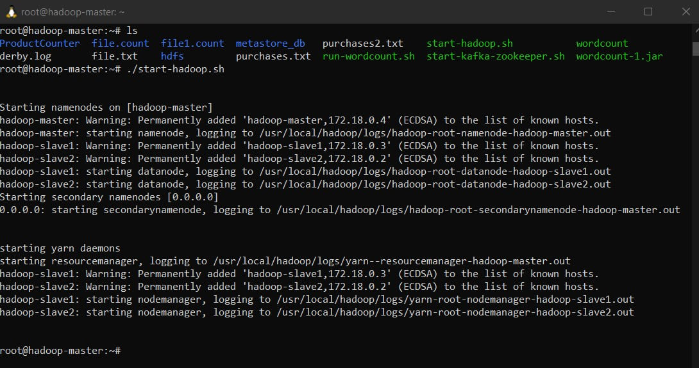
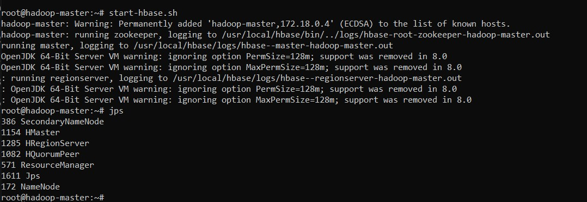
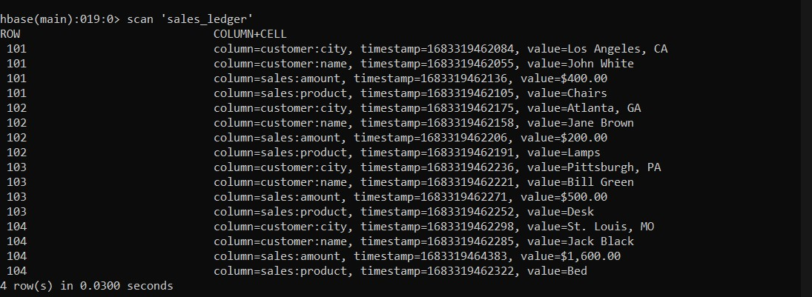
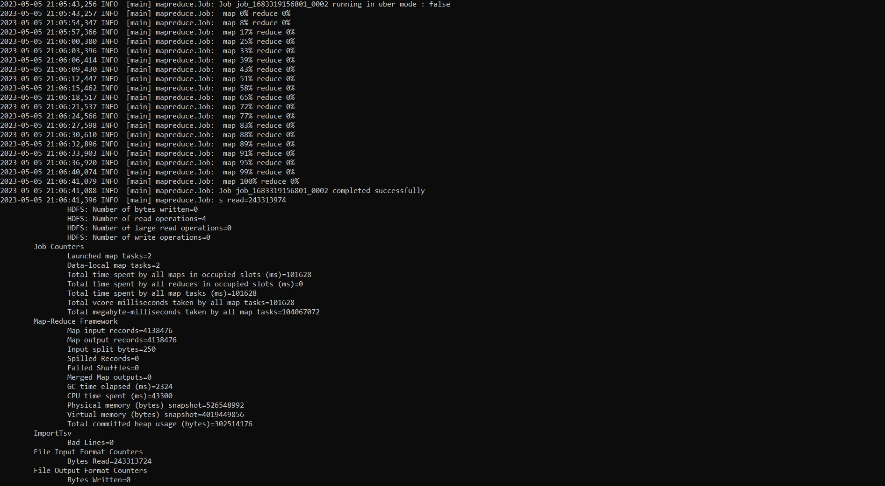
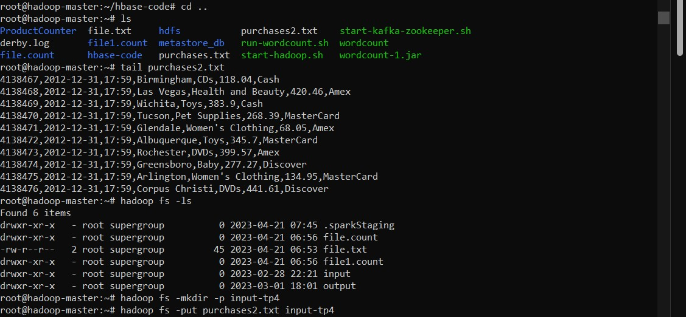
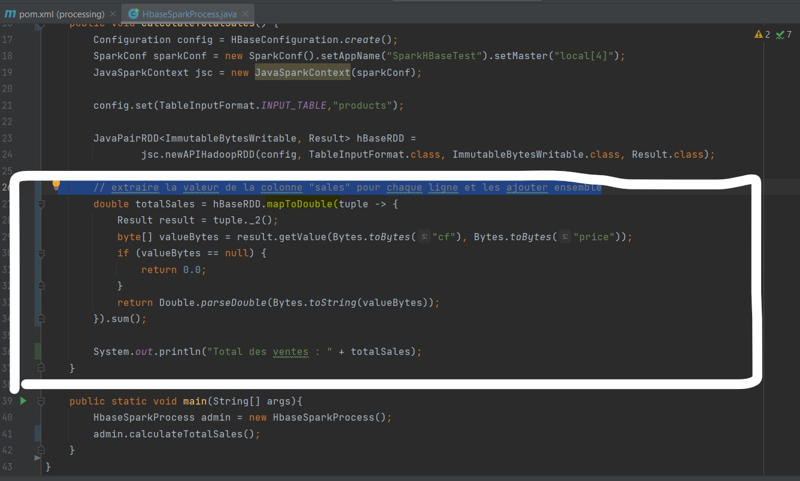
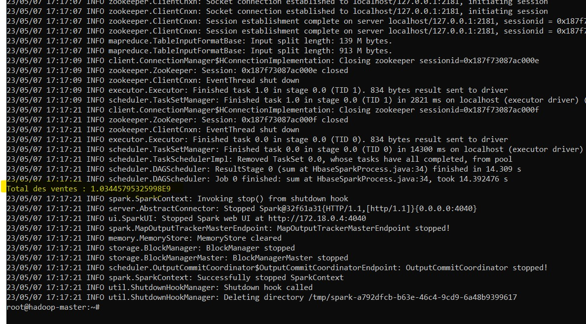

## Compte rendu du TP n° 4 : Stockage de Données dans une Base NOSQL avec HBase

### Réalisé par Fourati Aymen & Helali Eya

## Partie 1 : Première manipulation de HBase
### Initialisation de l'environement 

### Manipuler votre base de données avec son shell interactif 

### Commençons par créer la table, ainsi que les familles de colonnes associées

## Partie 2 : HBase API

**Dans votre contenaire principal, créer un répertoire hbase-code à l'emplacement de votre choix, puis déplacez-vous dedans.**

**Tout en restant sous le répertoire hbase-code, compiler cette classe:**

## Partie 3 : Chargement de fichiers

Calculer le nombre d'enregistrements 

## Activités : Modification du code pour pouvoir calculer le total des ventes 

